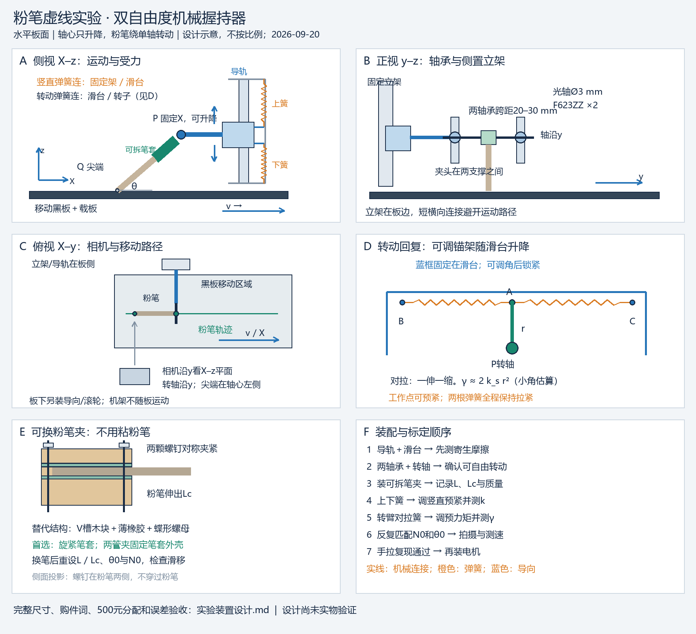

# 实验装置设计：可标定的机械握持器

版本：2026-09-20，设计稿，尚未实物验证。适用：两人、三个月、新增经费上限500元；无3D打印，不用胶粘粉笔。配套：[理论](理论推导.md)、[实验](实验方案.md)。

[矢量图 SVG](figures/机械握持器设计.svg)。图是原理与装配关系图，不是按比例的加工图；尺寸为建议起点，购件后按实物孔距配作。

## 1. 推荐结构及对用户设想的回应

采用“**竖直微型导轨＋轻滑台＋水平单轴铰链＋可拆笔夹**”。固定立架限制轴心水平移动；滑台上下移动；转轴允许粉笔在侧视平面转动。竖直弹簧连接固定架与滑台，转动回复组件则**整体装在滑台上**，这样滑台升降不会顺便拉伸转动弹簧。

- 圆珠笔压簧可用于早期筛选，但刚度、行程、屈曲与端部摩擦须实测。正式版推荐成对拉簧，容易预紧、换档和量力。
- 游戏摇杆适合演示“松手回中”。厂商给出的操作转矩和回中精度不等于一条线性力矩曲线；还多出第二转轴及部分型号的按压行程。因此主方案采用只有一个转轴的弹簧转臂，摇杆作为标定通过后才用的备选。[S1]
- 竖直板本身只限制一个方向；如果让夹头直接在板上摩擦，会把导向黏滑误认为粉笔黏滑。用板支撑导轨，由导轨约束水平位移。
- 本设计近似模拟手的两项被动顺应性，不复刻手指的主动反馈、皮肤接触或全部阻尼。

## 2. 外形与建议尺寸

| 部件/空间 | 建议起点 | 必须核对 |
|---|---|---|
| 固定底板 | 约500×300 mm，已有木板优先 | 夹紧桌面，立架不能随黑板走 |
| 黑板及移动载板 | 约350×180 mm，有效匀速测量段≥200 mm | 起步、停止在分析段外 |
| 立架 | 高约200–250 mm，侧向加三角角码 | 不挡侧视笔尖 |
| 竖直导轨 | MGN7，长100 mm，一只配套滑块 | 轻预压/低阻，检查实际孔距、摩擦 |
| 滑台连接板 | 约70×80 mm薄铝片/木板，尽量减重 | 主运动行程以平衡点上下各10 mm起步 |
| 转轴 | 光轴直径3 mm，两只F623ZZ法兰轴承 | 轴承内径3、外径10、宽4 mm；法兰外径按供货图确认 |
| 轴承支撑间距 | 约20–30 mm | 支撑孔同轴，不以拧紧消除错位 |
| 粉笔几何 | 转轴至尖端L约45–65 mm，夹口外露Lc约20–35 mm | 初次可用L≈55 mm，按实际粉笔长度确认 |
| 转动回中臂 | 半径r=15、20、25 mm三个孔位 | 锁紧中心轮毂，孔位选择后重标定 |
| 角度窗口 | 初扫30°、50°、70°，动态摆幅先±10° | 机械限位留到约±20°，以不碰撞为准 |

角度从水平板面量，不从竖直方向量。低角度时检查笔套、转臂和滑台下缘是否先碰板。黑板路线上方只保留必要的粉笔段；立架位于轨迹侧方，用短而刚的横向连接件将轴心伸到板面上方。转轴沿y，侧视相机沿y看。长悬臂会产生额外弯曲，故横向悬伸尽量≤50 mm并测量实际水平漂移。

允许借用手电钻、锯、螺丝刀、卡尺；不要求铣床或打印机。轴承孔可用两块叠紧的3–5 mm木片一次钻10 mm通孔以保证同轴，法兰在外侧用薄压片限位。孔松时更换支撑片，不能靠挤压轴承外圈纠偏。若无法借到钻具，购买预钻孔板或请五金店代钻，费用计入结构额度。

## 3. 竖直弹性模块：上下两根预拉弹簧

在滑台中心线上方和下方各接一根拉簧，固定端分别接立架的上下可调挂点；活动端接滑台上下耳片。弹簧避开黑板和转臂。上拉簧向上拉，下拉簧向下拉；二者在全行程中都保持拉紧。

在局部线性范围内：

$$
F_z(h)=F_{b}-k(h-h_r),\qquad k=k_{\rm 上}+k_{\rm 下}.
$$

向上移动时，上簧缩短、向上拉力减小；下簧伸长、向下拉力增加，净力因此向下恢复。初拉力会影响截距，不能把拉簧力从零延伸起算；制造商资料也说明拉簧通常有初拉力。[S3]

- 第一批筛选每根刚度约0.01–0.03 N/mm的弱拉簧，使总k约20–60 N/m；这是筛选目标，不是商品保证参数。
- 自由长约25–50 mm、外径约4–8 mm仅作搜索起点；不能凭尺寸断言刚度。先买少量几种规格，挂砝码拟合。
- 上下挂点用M4螺杆、螺母和长孔/多孔板调节，初设伸长至少覆盖向该侧回缩的最大行程，并留余量，不超过厂家允许伸长。
- 通过差动预紧调合力截距，使重量由上拉簧大部分抵消，再保留所需向下预载。所需总力要根据**装好后的整个移动组件质量**计算，不能只称粉笔。
- 示例：移动质量60 g、N0=0.30 N，则静态弹簧净向上力约0.289 N；若k=40 N/m，改变平衡位置1 mm可造成约0.04 N的预载变化。示例不是本机实测。

M4粗牙螺距常见0.7 mm，但采购时核对；用标尺/卡尺记录实际挂点，不以“转一圈”直接当力标定。

## 4. 转动弹性模块：单轴转臂＋左右对拉弹簧

用3 mm光轴和两只微型轴承承载粉笔夹。中间用小型3 mm夹紧轮毂/止动环与转臂固定，不能让夹头在轴上空转。光轴由止动环轴向定位，留微小转动余隙；不要用螺母把轴承内外圈一起压死。优先选法兰轴承，其公开规格可核对。[S4]

在与粉笔夹刚性连接的转臂上选半径r处的挂点A。以**弹簧中性角**为参考，让A位于P的上方；A左右分别接一根相同拉簧，远端固定在同高的B、C点。B、C都属于滑台上的“可调角锚架”，不属于地面固定立架。转臂转动，左右弹簧一伸一缩，产生回中力矩。

小角、对称、保持拉紧时：

$$
\gamma\approx2k_s r^2.
$$

例如单根 $k_s=40\ \mathrm{N/m}$、$r=20\ \mathrm{mm}$，则 $\gamma\approx0.032\ \mathrm{N\,m/rad}$；摆动10°对应约0.0056 N·m增量力矩。该式是选型估算；实际预紧、方向变化和孔位偏差由力矩标定吸收，不能替代实测。

B、C到中性位置A的水平距离建议35–50 mm。装好后让每根簧有足够预伸长覆盖 $r|\sin\varphi_{\max}|$（r=20 mm、20°时约6.8 mm），并额外留余量。发生松弛或碰圈即离开线性工作区。

**如何调初始角和预力矩：** 锚架绕P调角后用独立紧固件锁在滑台上；它不与自由转轴一起转。可用围绕P的多孔定位板粗调，两端M3挂点螺杆微调弹簧差动预紧。不具备弧形长孔时，不必加工弧槽，用多孔板加垫片即可。左右不等预紧会移动有效零力矩角，必须重新拟合截距。粉笔固定在转子上的安装角可用螺钉夹紧调节，使30°–70°板面角不要求弹簧从几何中性角扭几十度。

初始接触可能需要明显预力矩：L=55 mm、N0=0.5 N、θ0=50°，单法向力对轴力矩约0.0177 N·m（尚未扣重力/静摩擦）。若γ=0.032，靠中性位置偏转需约32°，已超预定小角范围。因此要**调整预紧/中性架位置或使用更硬弹簧/更大r，并实际检验工作点附近线性**，不能无条件沿用最软档。两侧弹簧的可调差动力矩估算为r乘两簧力差。

## 5. 粉笔可更换夹头

首选尺寸匹配的金属旋紧式粉笔套，再用两只小管夹把**笔套外壳**固定到转子连接片上；转子、笔套、粉笔形成刚性组合。笔套须无明显轴向窜动，不能只靠按压棘爪松松卡住。

替代方案：两片小木块做V形槽，用两颗M3螺钉及蝶形螺母夹合，内衬0.5–1 mm薄橡胶。橡胶只覆盖约15–20 mm夹持区，避免厚软衬层形成第三个明显自由度。槽可锯削，或用现成V槽小夹块。螺钉不要直接顶粉笔；两侧逐次对称拧紧到不滑即可，先用废粉笔验证不会压碎。

更换流程：松夹 → 取出粉笔 → 同批新粉笔插入 → 用硬尺/可移除挡块设置L与Lc → 对称夹紧 → 移除挡块 → 测角和预载。画两条对齐标记监测粉笔相对夹口滑移。粉笔变短、换笔套或夹头质量变化后重新记录惯性配置和自由振动；无需拆毁任何粘接。

## 6. 黑板驱动与拍摄

黑板固定在平整载板上，用两侧导向与小滚轮或简易滑轨保持直线。预实验手拉细线找窗口，记录真实速度；正式速度试验优先减速电机＋PWM＋完整电源，使用固定有效半径卷线轮、单层绕线，有效段不跨绕线层。建议先探索0.02–0.15 m/s，再按分辨率和点数收缩。

侧视相机与板面近同高，画面包括尖端、转子上两处标记、滑台和板面标记。手机固定、强连续光、短曝光，实测采样帧率；每周期目标≥10帧。板面标记测速，转子标记测θ，滑台标记测h，同时算d与u。尖端受遮挡时，由P和θ重建的位置须先验证L及刚性假设。拍完同条线再拍俯视点迹与尺。

启动实验和稳态实验分开：第一次起跳需要从接触静止状态记录整段启动；稳态点距试验丢弃加速和减速段。不要把“抬笔后放到运动板上”当作静态θ0到首次起跳的同一流程。

## 7. 标定和是否符合模型的验收

下述为预定工程目标，未通过则调整或明确放宽模型，不宣称已达到。

1. **导向空载阻力**：断开弹簧和粉笔接触，考虑重力后，用逐级小砝码测向上/下刚开始运动所需净力，求死区；在装好转子侧向载荷后复测。目标寄生竖直摩擦≤最小N0的5%。例N0,min=0.2 N时是0.01 N，廉价导轨可能达不到；必须实测。导轨寿命/承载力参数不能证明满足此目标。[S2]
2. **水平约束**：跟踪轴心P，目标横向漂移≤0.1 mm或成像测量不确定度，以较宽者为准；若漂移与尖端运动同量级，不能再按X_P=0建模。
3. **竖直刚度**：笔尖离板，锁转角（仅标定时），用5–7档已知竖直小力覆盖实际位移，加载/卸载各3遍。拟合F=b−kh，减去/去皮重量。记录斜率、截距、回差；残差/回差目标≤工作满量程5%。
4. **转动刚度**：锁滑台高度（仅标定时），笔尖离板，在已知力臂施加砝码或弹簧秤力；实际力矩等于力乘垂直力臂。若直接用竖直挂重，其力臂是挂点相对轴心水平距离，随角变化。扣除转子重力矩、正反向测5–7角度，拟合M=b−γθ并求θr。加载/卸载差分离轴承摩擦。目标残差/回差≤工作力矩跨度5%。
5. **解耦**：在h0−5 mm、h0、h0+5 mm重复转矩标定；在三个θ重复竖直标定。斜率/截距变化超5%时检查弹簧锚点是否误装在固定架，必要时报告二维刚度而不称完全独立。
6. **预载**：将电子秤上接触面的高度设为实际板面高度，笔架支撑在秤外；去皮后测N0，5次提起放下检查离散。若秤太厚，用独立支架悬空/抬高板面复现相同几何，不在改变h后直接使用秤读数。改变θ0后再次匹配N0。
7. **动态**：解除标定锁止，测离板自由振动与衰减，完整记录装配质量。空跑黑板、换手拉、改变板起始位置排除电机/板纹的伪周期。

## 8. 易购件与采购额度

以下是含运费分配的**采购上限，不是已核验到手报价**。来源核实了零件类别/规格，不保证国内平台此刻库存或低价。淘宝、京东、1688按搜索词查同规格，核对实物尺寸、退换条件；不需要购买工业原厂导轨。便宜替代件须自行验收摩擦。

| 采购项 | 搜索词/数量 | 上限元 |
|---|---|---:|
| 竖直导轨 | MGN7 100mm 一轨一滑块 低阻；1套 | 55 |
| 轴承与转轴 | F623ZZ 3x10x4 两只；3mm光轴、止动环、轮毂 | 35 |
| 两组弹簧 | 小拉簧 弱弹力 带钩；样品含备用 | 30 |
| 立架/转臂/锚架/紧固件 | 多孔铝条 直角角码 M3 M4 蝶母；旧木板优先 | 45 |
| 可拆夹头与粉笔 | 旋紧式金属粉笔夹；管夹；同批圆粉笔 | 20 |
| 黑板与背板 | 哑光粉笔小黑板；复用背板 | 35 |
| 黑板直线移动件 | 小滚轮 导向条/小滑轨；细线 | 35 |
| 电驱全套（通过预实验才买） | 直流减速电机 PWM 电源 固定半径卷线轮 | 60 |
| 静态秤 | 0.1g/1g小电子秤，优先借用 | 25 |
| 成像/测量附件 | 手机夹、标尺、灯；优先已有 | 25 |
| 运费/耗材余量 | 清洁布、垫片、补螺丝等 | 35 |
| **主预算** |  | **400** |
| **备用金** | 不预先花；摩擦失败改结构/换件 | **100** |
| **总额** |  | **500** |

前三项加夹头为140元，可在前两周≤150元内验证握持核心，但必须借用板面、立架木料、秤和工具；没有这些可借物时先缩减采购做弹簧/夹头子模块，不假定150元能买齐全部。贵于额度时取消电机、继续按实测速度研究，保留备用金和两周补测缓冲。

## 9. 装配顺序与失败替代

1. 先用已有板和手握粉笔确认材料能产生点迹，拍摄检出能力通过后再买全套。
2. 固定立架与竖直导轨，安装轻滑台，暂不挂弹簧，测空载摩擦。
3. 装两轴承、光轴和转子，装笔套，确认自由转动且不磨支架。
4. 装两根竖直拉簧，调至滑台可在中位平衡，留机械软限位防跌落。
5. 装转臂和滑台随动锚架，再挂两根对拉簧，调工作角与预力矩，确认两簧全程拉紧。
6. 设L、Lc，把板置于正确高度；反复调N0和θ0直至同时命中，再进行独立标定。
7. 手拉探索，过跨天复现门槛才装电机。拆除所有标定锁紧件后才能拍正式运动。

若MGN7摩擦死区过大，先排除歪装/过紧、粉尘和横向偏载，不通过拆防尘件掩盖问题。仍失败时启用**平行双簧片柔性导向**：两条相同弹性薄片上下平行夹在立架与滑台间，薄片长度约80–100 mm、宽15–20 mm，厚度先筛选0.1–0.2 mm弹簧钢片；两端用夹条螺钉固定、包住切边。小挠度导向无滑动摩擦，竖直有效刚度另加两簧片贡献，约 $24EI/\ell^3$（双固定导向梁理想近似，$I=bt^3/12$）。

这个备选**不是完全等价**：有约位移平方/片长量级的水平寄生位移，以及附加刚度和可能的台面转角。先限制竖直幅度约±3 mm、测P轨迹，超出误差目标则保留X_P(t)扩展模型。不能一边使用大幅柔性导向，一边声称轴心水平完全固定。单片尺子弯曲仅用于复现，不再作为当前双自由度模型的正式装置。

## 10. 外部选型依据

- [S1 Alps Alpine 摇杆机制与规格](https://tech.alpsalpine.com/e/products/faq/muiti-control-device/thumbpointer/)：标准摇杆有两正交轴；RKJXV给出操作转矩、行程与回中精度，没有据此获得本装置的线性γ。
- [S2 HIWIN 微型导轨官方目录](https://hiwin.co.uk/wp-content/uploads/2017/06/Linear-Guideways.pdf)：微型导轨有不同预压/间隙选择；用于规格核对，不把便宜替代件视为同等性能。
- [S3 Newcomb Spring 拉簧资料](https://newcombspring.com/pdf/ExtensionSellsht.pdf)：初拉力与力—伸长斜率的区别。
- [S4 EZO F623ZZ 厂商规格](https://www.ezo-brg.co.jp/english/product/spec.php?eid=00267)；[国内规格参考：米思米法兰微型轴承](https://www.misumi.com.cn/pdf/fa/2015/p781.pdf)。
- [商品类别示例：MGN7导轨套件](https://shopee.com.my/1pcs-MGN7-100mm-800mm-Miniature-Linear-Rail-Slide-1pc-MGN7-Linear-Guide+1pc-MGN7H-Carriage-CNC-Parts-i.298182316.6549471886)：仅表明此类成套件可采购，不作价格、质量或指定平台推荐。

检索日期2026-09-20。全部结构布局、尺寸、预算和验收阈值为本项目工程建议，尚无实物运行证据。
